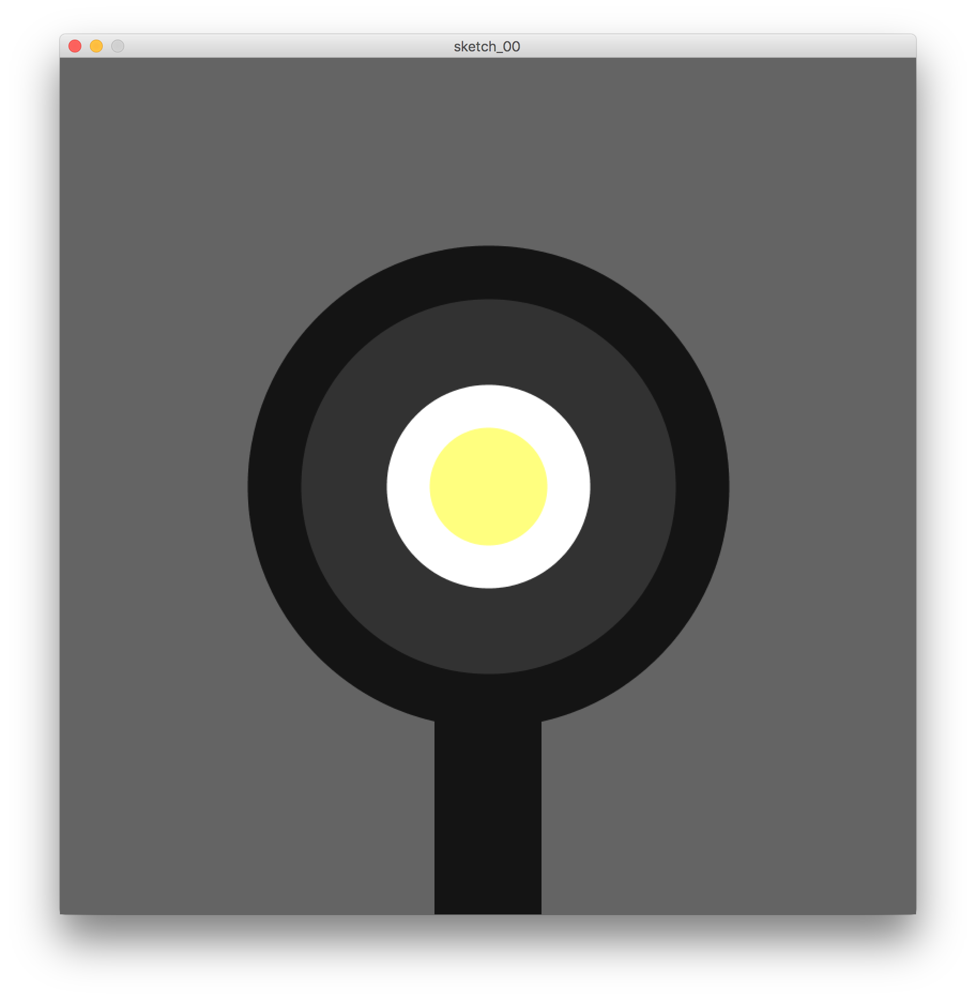

# Description du programme

Programme pour dessiner un œuf au plat.

# Déroulé des actions programmées

- Ouvrir une fenêtre de 800 pixels de large par 800 pixels de haut
- Afficher un arrière-plan en gris `[Rouge=100, Vert=100, Bleu=100]`
- Dessiner un rectangle gris, sans contour, pour le manche de la poêle
- Dessiner une ellipse grise pour le corps de la poêle
- Dessiner une ellipse jaune avec contour blanc pour l'œuf
