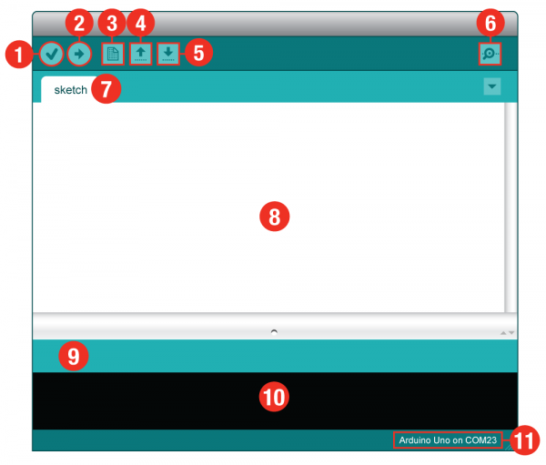
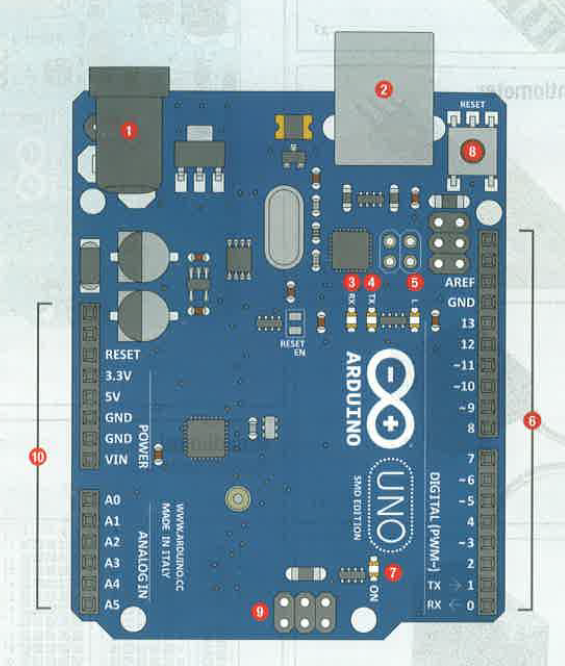

# Initiation à Arduino

## Qu'est-ce qu'Arduino ?

Arduino est une plateforme de prototypage électronique open-source, basée d’une part sur du matériel ([Arduino microcontroller](http://www.arduino.com)), sur du logiciel ([Arduino IDE](http://arduino.cc/en/Main/Software)) et sur un langage de programmation (les fonctions et bibliothèques sont écrites en langage C ou C++). 

Une carte Arduino communique avec son environnement par l’intermédiaire de ses broches d’entrée et de sortie. 

Sur les broches `input`, nous pouvons connecter des capteurs (des dispositifs permettant de transformer une information de l’environnement en signal électrique) et sur les broches `output` nous pouvons connecter des actionneurs (dispositifs permettant de transformer un signal électrique en action mécanique ou lumineuse).

- Recevoir des informations venant des capteurs (`INPUT`)
- les traiter dans notre programme 
- envoyer des informations pour commander des actionneurs (`OUTPUT`)

### La plateforme matérielle
Les cartes Arduino sont des circuits électroniques composés de connecteurs reliés à un micro-contrôleur programmable. Les cartes Arduino peuvent être alimentés par le port USB de l'ordinateur (elles fonctionnent en interne à 3,3V ou à 5V) mais aussi par une alimentation extérieure variant entre 7 et 12V. Il ne faut pas excéder ces valeurs, sinon la carte et les composants branchés pourraient être endommagés (et en plus cela peut entrainer un risque pour l'utilisateur). 

### L'environnement logiciel
L'environnement de programmation pour Arduino ([Arduino IDE](http://arduino.cc/en/Main/Software)) est un logiciel gratuit open-source.
- il permet d'écrire des programmes en langage Arduino et de tester leur validité
- il permet de les compiler et de les "téléverser" vers la carte Arduino
- il permet de communiquer avec le microcontroleur et de recevoir ses messages

### Le langage
Le langage informatique Arduino est inspiré des langages C et C++. Ses commandes sont adaptées aux besoins de la carte, surtout celui qui consiste à communiquer avec ses différents connecteurs.

## Ressources et bibliographie 
- [Site web de la plateforme](https://www.arduino.cc/)
- [Ressources langage, librairies, glossaire](https://www.arduino.cc/reference/en/#page-title)  
- [Tutoriels](https://www.arduino.cc/en/Tutorial/HomePage)
- [Tutoriels Sparkfun](https://learn.sparkfun.com/)
- [*Sparkfun Inventor's Kit* pour Arduino](https://learn.sparkfun.com/tutorials/sparkfun-inventors-kit-experiment-guide---v40)
- *Projets créatifs avec Arduino* par B. Affagard, J.-M. Guéridan, J.-N. Lafargue
- *Les capteurs pour Arduino et Raspberry Pi* par Tero Karvinen , Kimmo Karvinen , Ville Valtokari


## 1 - Arduino IDE et hardware

### Arduino IDE



1 - Verify: Compile et valide le code. Signale les erreurs de syntaxe (comme des `;` ou des `()` manquants  
2 - Upload: Envoie votre code au board Arduino. Lorsque vous cliquez dessus, les voyants de votre Arduino devraient clignoter rapidement  
3 - New: Ce bouton ouvre une nouvelle fenêtre pour éditer du code  
4 - Open: Ce bouton vous permet d’ouvrir un sketch.ino existant  
5 - Save: Ceci enregistre le sketch.ino actuellement actif  
6 - Serial Monitor: Ouvre une fenêtre qui affiche toutes les informations serial transmises par la carte Arduino  
7 - Sketch Name: Nom du sketch sur lequel vous travaillez actuellement  
8 - Code Area: Zone pour écrire le code de votre programme  
9 - Message Area: C'est ici qu'Arduino IDE vous indique s'il y a des erreurs dans votre code  
10 - Text Console: La console texte affiche des messages d'erreur complets  
11 - Board and Serial Port: Vous montre la carte et le port série choisis

### Arduino board



1 - Power in (barrel jack): peut-être utilisé avec une alimentation 9V ou 12V  
2 - Power in (USB port): fournit de l'énergie et communique avec votre carte lorsqu'il est branché sur votre ordinateur via USB  
3 - LED RX (Receiving): clignotte quand Arduino est en train de recevoir des données (comme lors de la programmation)  
4 - LED TX (Transmitting): indique la transmission de données par Arduino (comme lors de l'exécution d'un programme)  
5 - LED (Pin 13 Trubleshooting): cette led est liée à votre programme pour montrer s'il est en cours d'exécution  
6 - Pins (ARef, Ground, [Digital pins](https://www.arduino.cc/en/Tutorial/DigitalPins), Rx, Tx): différentes broches peuvant être utilisées pour les entrées, les sorties, l'alimentation et la terre  
7 - LED: indique si Arduino est ON
8 - Reset button: c'est un moyen de réinitialiser manuellement votre Arduino, et de faire redémarrer votre code  
9 - ICSP Pins (uploading code without Bootloader): this is for "in-circuit serial programming" used if you want to bypass the boot loader  
10 - Pins (Analog in, Power In, Ground, Power out, Reset):  différentes broches peuvant être utilisées pour les entrées, l'alimentation et la terre

### Breadboard


### 2 - Structure d'un programme, `pinMode()`, `digitalWrite`

```java
// 1 - Entête du programme 

// espace pour déclarer des librairies externes
// #include <nomDeLaLibrairie>

// définir des constantes 
// const type nom = valeur;  ou  #define nom valeur;

// déclarer des variables globales qui seront modifiées lors de l'éxécution du programme
// type nom;

// 2 - Fonction setup()
void setup() {
  // commandes exécutées une seule fois, au lancement du programme 
}

// 3 - Fonction loop()
void loop() {
  // commandes exécutées cycliquement 
}
```

[`pinMode()`](https://www.arduino.cc/reference/en/language/functions/digital-io/pinmode/)  
Configure la broche pour qu'elle se comporte comme une entrée ou une sortie.

[`digitalWrite()`](https://www.arduino.cc/reference/en/language/functions/digital-io/digitalwrite/)  
Écrit une valeur HIGH ou LOW sur une broche numérique.

[→ exercice 0 : blink](/2-Arduino/ex00_blink)  
[→ exercice 1 : blink LED](/2-Arduino/ex01_blink_LED)


### 3 - Variables, `analogRead()` et `println()`

[Variable](https://www.arduino.cc/en/Reference/VariableDeclaration)  
Une variable est un moyen de nommer et de stocker une valeur pour une utilisation ultérieure par le programme (par exemple des données provenant d'un capteur ou une valeur intermédiaire utilisée dans un calcul de mapping).

[`analogRead()`](https://www.arduino.cc/en/Reference/AnalogRead?setlang=en)  
Lit la valeur de la broche analogique et mappe sa tension d'entrée (comprise entre 0 et 5 volts) en valeurs entières (comprises entre 0 et 1023).

[`println()`](https://www.arduino.cc/en/Serial/Println)

[→ exercice 2 : LED + potentiomètre](/2-Arduino/ex02_LED_potentiometer)


### 4 - `digitalRead()`, structures de contrôle, opérateurs boléens

[`digitalRead()`](https://www.arduino.cc/reference/en/language/functions/digital-io/digitalread/)
Lit la valeur de la broche numérique spécifiée, qui sera soit HIGH ou LOW.

Comme un bouton-poussoir n'a que deux états (poussé ou non poussé), il faut le connecter sur une broche digitale que nous allons déclarér comme `INPUT`.
Pour lire cette entrée, nous utilisons la fonction `digitalRead()` Cette fonction prend un paramètre (le numéro de broche), et renvoie soit HIGH (5V) soit LOW (GND).

Structures de contrôle :
- `if ...`
- `if ... else ...`
- `if ... else if ... else`
- `switch`et `case` 

[→ exercice 3 : LED + 1 boutton pressoir](/2-Arduino/ex03_pushbutton_LED)

Opérateurs boléens :
- `&&`  and
- `||`  or 
- `!`  different from

[→ exercice 4 : LED + 2 bouttons pressoirs](/2-Arduino/ex04_pushbuttons_LED)


## License

[MIT.](https://tldrlegal.com/license/mit-license)
