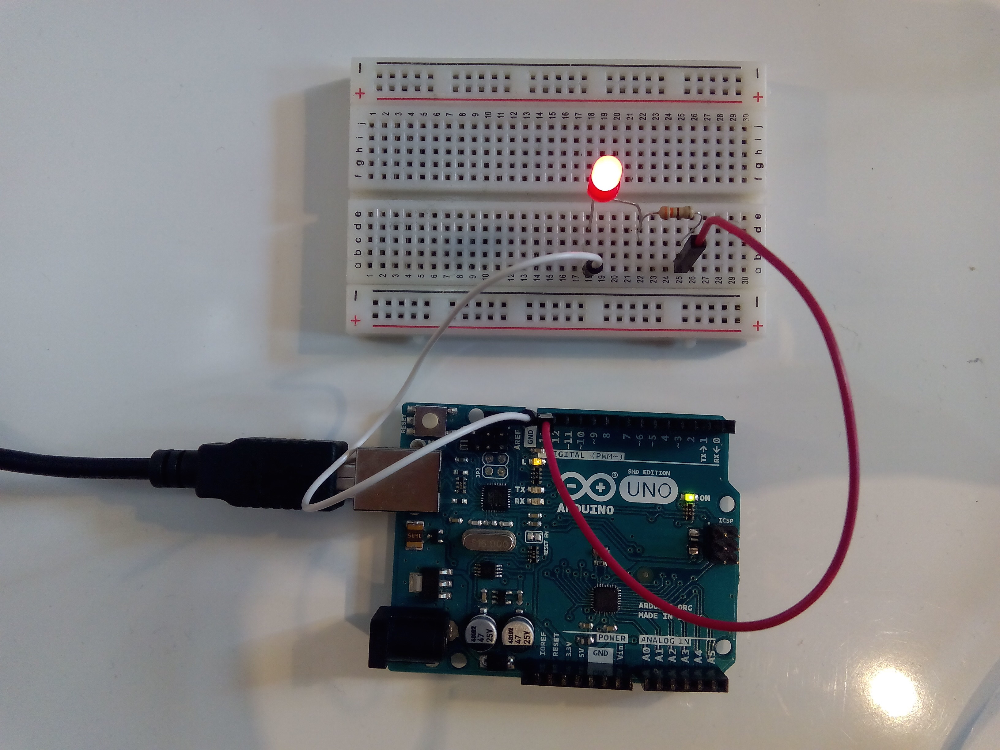

# Description du programme
Programme pour faire clignoter le LED connecté à la broche digitale 13.

# Matériel
  - Arduino Uno
  - LED
  - Résistance 330 ohm
  - Breadboard
  - Câbles

# Connectique
  - LED + connecté au pin 13
  - LED — connecté à la résistance 220 ohm
  - Résistance 330 ohm connecté au GND

# Déroulé des actions programmées
  - allume le LED pendant une seconde
  - éteint le LED pendant une seconde
  - action répétée en boucle

# Fonctions utilisées

[`pinMode()`](https://www.arduino.cc/reference/en/language/functions/digital-io/pinmode/)
Configure la broche pour qu'elle se comporte comme une entrée ou une sortie.

[`digitalWrite()`](https://www.arduino.cc/reference/en/language/functions/digital-io/digitalwrite/)
Écrit une valeur HIGH ou LOW sur une broche numérique.