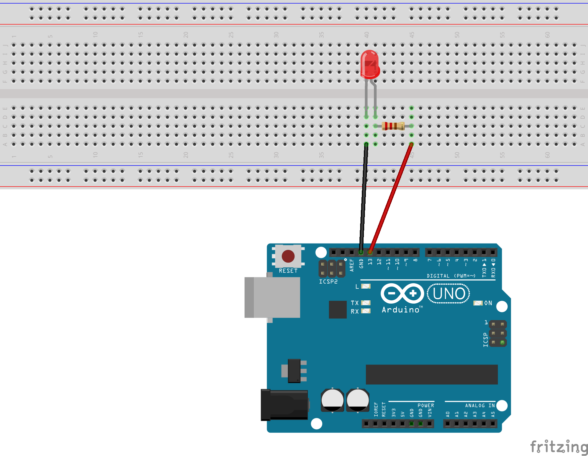

# Description du programme
Programme pour faire clignoter le LED connecté à la broche digitale 13.

# Matériel
  - Arduino Uno
  - LED
  - Résistance 220 ohm
  - Breadboard
  - Câbles

# Connectique
  - LED + connecté au pin 13
  - LED — connecté à la résistance 220 ohm
  - Résistance 220 ohm connecté au GND

# Déroulé des actions programmées
  - allume le LED pendant une seconde
  - éteint le LED pendant une seconde
  - action répétée en boucle

# LED

Most Arduinos already have an LED and resistor connected to pin 13, so you may not need any additional circuitry.

But if you'd like to connect a second LED to pin 13, or use a different pin, follow these steps:

Connect the positive side of your LED (longer leg) to Arduino digital pin 13 (or another digital pin, but don't
forget to change the code to match).
Connect the negative side of your LED (shorter leg) to a 330 Ohm resistor (orange-orange-brown).
Connect the other side of the resistor to ground.