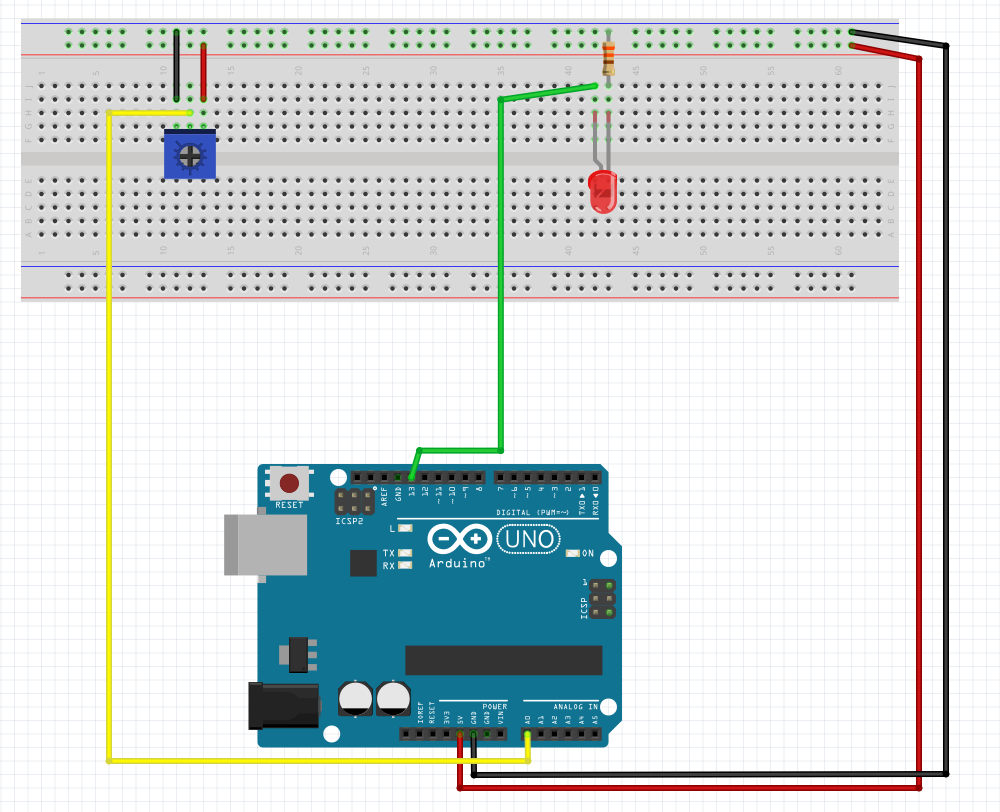

# Description du programme
Mesurer la position d’un potentiomètre et l’utiliser pour contrôler le rythme de clignotement d'une LED.

# Matériel
  - Arduino Uno
  - LED
  - Résistance 330 ohm
  - Potentiomètre
  - Breadboard
  - Câbles

# Connectique
  - LED + connecté au pin 13
  - LED — connecté à la résistance 220 ohm
  - Résistance 330 ohm connectée au GND 
  - Potentiomètre broche ext 1 connectée au 5V
  - Potentiomètre broche ext 2 connectée au GND
  - Potentiomètre broche centrale connectée au pin ANALOG IN A0

# Déroulé des actions programmées
  - lis la position du potentiomètre
  - affiche la valeur du potentiomètre dans le serial monitor
  - allume le LED
  - temps d'allumage défini par la position du potentiomètre
  - éteint le LED
  - temps d'extinction défini par la position du potentiomètre

# Qu'est-ce qu'un potentiomètre ?
Un potentiomètre, ou "pot" en abrégé, est un bouton de commande. Un potentiomètre change de résistance en tournant. En l’utilisant comme "diviseur de tension", l’Arduino peut détecter la position du bouton et utiliser cette valeur pour contrôler ce que vous voudrez (comme le rythme de clignotement d’un LED dans notre exemple).

Les potentiomètres ont trois broches. Lorsque nous l'utilisons comme diviseur de tension, nous connectons les broches extérieures à l'alimentation et à la terre. La broche du milieu sera le signal (sa tension varie de 0 à 5 volts en fonction de la position du bouton).

Si, une fois que votre programme est en cours d’exécution, le bouton fonctionne "à l'envers", vous pouvez connecter les broches 5V et GND en sens inverse.

# Variables

Une [variable](https://www.arduino.cc/en/tutorial/variables) est un moyen de nommer et de stocker une valeur pour une utilisation ultérieure par le programme (par exemple des données provenant d'un capteur ou une valeur intermédiaire utilisée dans un calcul de mapping).

Les variables seront de la nature du nombre que nous utilisons, voir [la liste complète de déclaration de variables](http://arduino.cc/en/Reference/VariableDeclaration).

NB : si vous déclarez des variables en dehors d’une fonction, elles sont appelées "variables globales" et peuvent être vues par toutes les fonctions. Si vous déclarez des variables dans une fonction, elles ne peuvent être vues que dans cette fonction.

# pinMode()

[`pinMode()`](https://www.arduino.cc/reference/en/language/functions/digital-io/pinmode/) configure la broche pour qu'elle se comporte comme une entrée ou une sortie.

Nous allons utiliser la broche 13 pour allumer une LED, nous devons donc la configurer comme sortie.
Comme nous avons déjà créé une variable appelée `ledPin` et que nous lui avons attribué la valeur 13, nous pouvons utiliser `ledPin` à la place de `13` pour rendre le programme plus lisible. Cela signifie que `pinMode (ledPin, OUTPUT)` est identique à `pinMode (13, OUTPUT)`

Nous n'avons pas besoin de configurer `sensorPin` en tant qu'entrée parce qu'il s'agit d'une broche "entrée analogique". Ces broches ont la capacité de lire des tensions variables provenant de capteurs tels que le potentiomètre.

# analogRead()

L'Arduino peut lire la tension sur une broche d'entrée analogique (comprise entre 0 et 5 volts) et la "mapper" en une valeur entière (comprise entre 0 et 1023) à l'aide de la fonction `analogRead ()`. 

Dans notre programme, cette fonction prend la valeur d'entrée venant de la broche analogique (`potPin`, que nous avions précédemment définie sur `A0`). Il renvoie un nombre entier compris entre 0 (0 volts) et 1023 (5 volts). Nous stockons cette valeur dans la variable `potValue` et nous l'utilisons pour modifier le rythme de clignottement du LED  (plus le nombre est petit, plus il clignotera rapidement).

