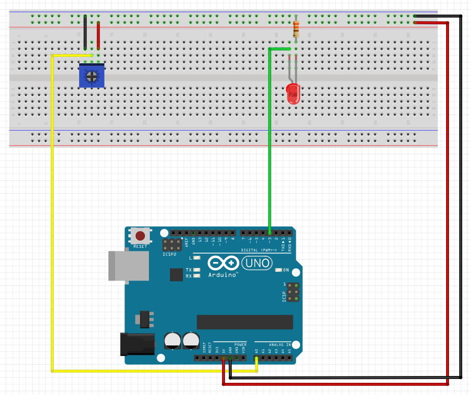

# Description du programme
Mesurer la position d’un potentiomètre et l’utiliser pour contrôler le bright d'un LED.

# Matériel
  - Arduino Uno
  - LED
  - Résistance 330 ohm
  - Potentiomètre
  - Breadboard
  - Câbles

# Connectique
  - LED + connecté au pin 13
  - LED — connecté à la résistance 220 ohm
  - Résistance 330 ohm connectée au GND 
  - Potentiomètre broche ext 1 connectée au 5V
  - Potentiomètre broche ext 2 connectée au GND
  - Potentiomètre broche centrale connectée au pin ANALOG IN A0

# Déroulé des actions programmées
  - lis la position du potentiomètre, analogique (0-1023)
  - transforme la valeur analogique (0-1023) en valeur PWM(0-255) et l'écris sur la broche du LED
  - affiche la valeur dans le serial monitor

# analogWrite()
Écris une valeur analogique (onde PWM) sur une `~ broche`. La fonction peut être utilisée pour allumer une LED à différentes intensités ou pour faire bouger un moteur à différentes vitesses.

