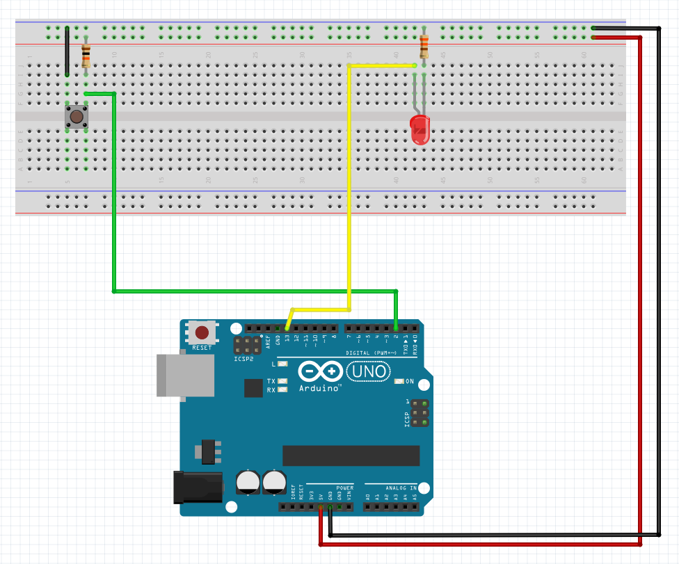

# Description du programme
Utiliser un bouton-pressoir pour créer un signal d'entrée `digital input` pour allumer et éteindre le LED.

Connecter un côté du bouton-poussoir à GND et l’autre côté à une broche numérique. 


# Matériel
  - Arduino Uno
  - LED
  - Résistance 330 ohm
  - x1 Bouton-pressoir
  - x1 Résistance 10k ohm
  - Breadboard
  - Câbles

# Connectique
  - LED + connecté au pin 13
  - LED — connecté à la résistance 330 ohm
  - Résistance 330 ohm connectée au GND 
  - Une broche du bouton connecté au GND
  - La broche diagonale opposée du bouton-poussoir connectée au digital pin 2
  - Une résistance 10K (marron / noir / rouge) connecte le digital pin 2 au 5V
    Celle-ci est appelée résistance "pullup". Elle assure que la broche d'entrée soit 5V (bouton non poussé) ou GND (bouton poussé), et non une valeur entre les deux.
    Rappelez-vous que, contrairement aux entrées analogiques, les entrées numériques ne sont que HIGH ou LOW.

# Déroulé des actions programmées
  - Quand on n'appuie pas sur le bouton poussoir :
      - la broche `digital pin 2` est lue comme `HIGH` par l'Arduino
      - le LED est allumée

  - Quand on appuie sur le bouton poussoir :
      - la broche du bouton se connecte à GND
      - la broche `digital pin 2` est lue comme `LOW` par l'Arduino
      - le LED s'étteint

# Bouton-poussoir

Les boutons-poussoirs ont deux broches qui se connectent lorsque vous appuyez sur le bouton.


# `digitalRead()`

Comme un bouton-poussoir n'a que deux états (poussé ou non poussé), il faut le connecter sur une broche `digital` que nous allons déclarér comme `INPUT`. 

Pour lire cette entrée, nous utilisons la fonction `digitalRead ()`. Cette fonction prend un paramètre (le numéro de broche), et renvoie soit `HIGH` (5V) soit `LOW` (GND).

Si le bouton est enfoncé, il sera connecté à GND. Si le bouton n'est pas enfoncé, la résistance pullup le connectera à 5 volts.
**Ainsi, l’état de `digital pin 2` sera `LOW` lorsque le bouton sera appuyé et `HIGH` quand il ne sera pas appuyé.**


# Structures de contrôle 

- `if ...`
- `if ... else ...`
- `if ... else if ... else`
- `switch`et `case` 


```java
  if (button1State == HIGH){     // si l'état du bouton-pressoir est HIGH donc
    digitalWrite(ledPin, HIGH);  // allume le LED
  }
  else {
    digitalWrite(ledPin, LOW);  // éteint le LED
  }
```