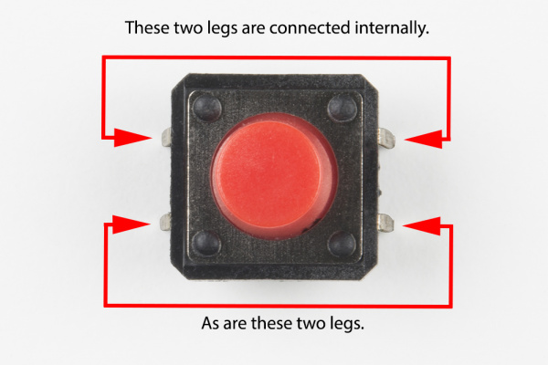
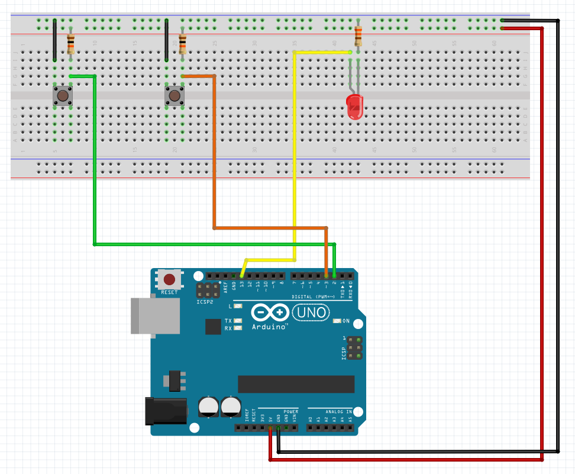

# Description du programme
Utiliser un bouton-pressoir pour créer un signal d'entrée `digital input` pour allumer et éteindre le LED.

Connecter un côté du bouton-poussoir à GND et l’autre côté à une broche numérique. 
Quand on appuie sur le bouton poussoir, la broche sera connectée à GND, et sera donc lue comme "LOW" par l'Arduino.


# Matériel
  - Arduino Uno
  - LED
  - Résistance 330 ohm
  - x2 Boutons-pressoirs
  - x2 Résistances 10k ohm
  - Breadboard
  - Câbles

# Connectique
  - LED + connecté au pin 13
  - LED — connecté à la résistance 330 ohm
  - Résistance 330 ohm connectée au GND 
  - Connect any pin on pushbutton 1 to ground (GND).
  - Une broche du bouton connecté au GND
  - La broche diagonale opposée du bouton-poussoir connectée au digital pin 2
  - Une résistance 10K (marron / noir / rouge) connecte le digital pin 2 au 5V
    Celle-ci est appelée résistance "pullup". Elle assure que la broche d'entrée soit 5V (bouton non poussé) ou GND (bouton poussé), et non une valeur entre les deux.
    Rappelez-vous que, contrairement aux entrées analogiques, les entrées numériques ne sont que HIGH ou LOW.

# Déroulé des actions programmées
  - 
  - 
  - 
  - 

# Bouton-pressoir

Les boutons-poussoirs ont deux contacts qui se connectent lorsque vous appuyez sur le bouton.
Rappelez-vous que si le bouton est enfoncé, il sera connecté à GND. Si le bouton n'est pas enfoncé, la résistance pullup le connectera à 5 volts.
**Ainsi, l’état sera LOW lorsqu’il est pressé et HIGH quand il n’est pas pressé.**


# Structures de contrôle, opérateurs boléens

Dans cet exemple, le LED s'allume lorsqu'un bouton est enfoncé. Traduisons cela en code informatique. L'Arduino a des fonctions logiques spéciales pour gérer la logique vraie / fausse:

## Les opérateurs boléens

On peut utiliser les opérateurs `&&` et `||` dans des structures de contrôle, dans le but d'associer des conditions.

`A == B` veux dire "EQUIVALENT". Cela est vrai si les deux côtés sont les mêmes
`A && B` veux dire "AND". Cela est vrai si les deux côtés sont vrais.
`A || B` veux dire "OR". Ceci est vrai si l'un des côtés est vrai.
`!A` veux dire "NOT". Ce qui suit sera l'inverse (true or false).


Nous pouvons utiliser ces opérateurs pour traduire les phrases ci-dessus en instructions logiques (rappelez-vous que LOW signifie que le bouton est enfoncé)

"Si l'un des boutons est enfoncé, le voyant s'allume" devient:
```java
 if ((button1State == LOW) && (button2State == HIGH)) // Seul le bouton 1 est enfoncé, allume le LED
 if ((button1State == HIGH) && (button2State == LOW)) // Seul le bouton 2 est enfoncé, allume le LED
```

Combinez les deux avec un OR (`||`) 

```java
if ((button1State == LOW) && (button2State == HIGH)) || ((button1State == HIGH) && (button2State == LOW))  // Si le bouton 1 est enfoncé ou si le bouton 2 est enfoncé, allume le LED
```

NB : nous utilisons `=` lorsque nous assignons une valeur et que nous utilisons `==` lorsque nous vérifions l'équivalence d'une valeur.