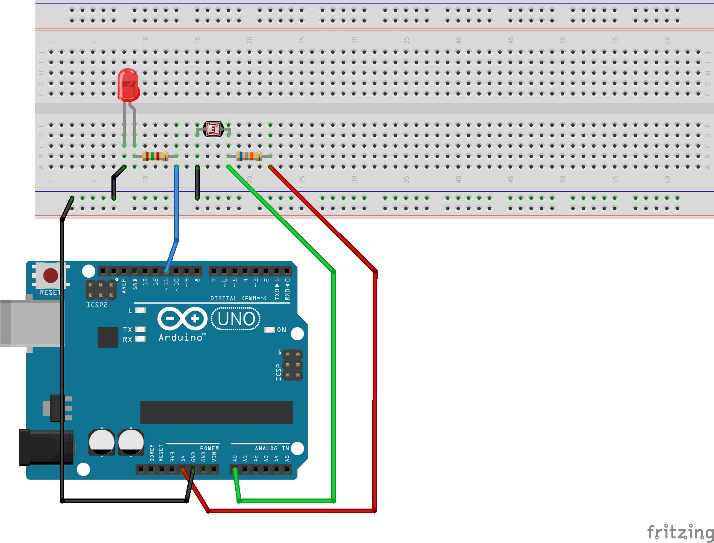
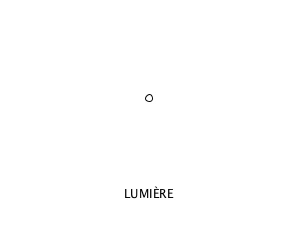

# Input un capteur

## Description du programme

Programme pour faire dimmer le LED et transformer une ellipse avec la valeur provenante du capteur LDR sur le shield.

## Photorésistance
Une photorésistance (également appelée résistance photo-dépendante ou cellule photoconductrice) est un composant électronique dont la résistivité varie en fonction de la quantité de lumière incidente : **plus elle est éclairée, plus sa résistivité baisse.**

## `map()`

