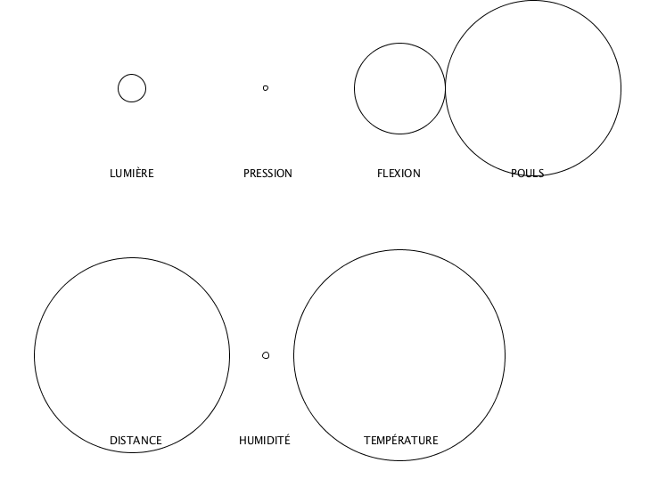

# Input tous les capteurs

- [Photoresistor](https://www.sparkfun.com/products/9088) → Lumière → `capteurLDR`
- [Force Sensitive Resistor](https://www.sparkfun.com/products/9375) → Force (pression) → `capteurFSR`
- [Flex sensor](https://www.sparkfun.com/products/10264) → Flexion → `capteurFLEX`
- [Pulse sensor](https://www.sparkfun.com/products/11574) → Pouls → `capteurPOULS`
- [Ultrasonic Range Finder](https://www.sparkfun.com/products/639) → Distance → `capteurSONAR`
- [Humidity sensor](https://www.adafruit.com/product/1899) → Humidité → `humidity` et `temperature`