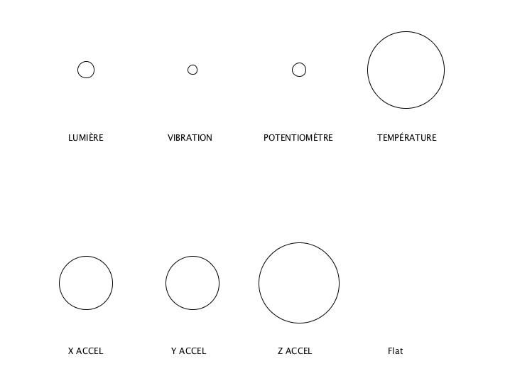

# Input tous les capteurs

- [Photoresistor](https://www.sparkfun.com/products/9088) → Lumière → `capteurLDR`
- [Piezo Vibration Sensor](https://www.sparkfun.com/products/9197) → Vibration → `capteurPIEZO`
- [Soft potentiometer](https://www.sparkfun.com/products/8680) → Variation de résistance par le toucher → `capteurPOT` 
- [Temperature Sensor](https://www.sparkfun.com/products/10988) → Température → `capteurTEMP` 
- [Triple Axis Accelerometer](https://www.sparkfun.com/products/12756) → Accélération sur trois axes → `inclinaison` / `xValue` / `yValue` / `zValue` 