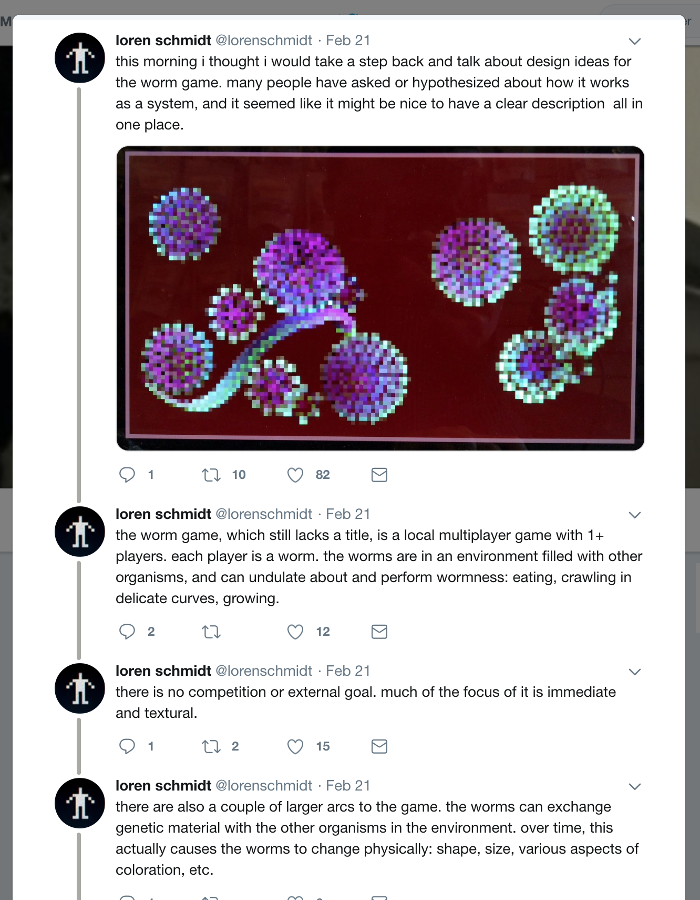
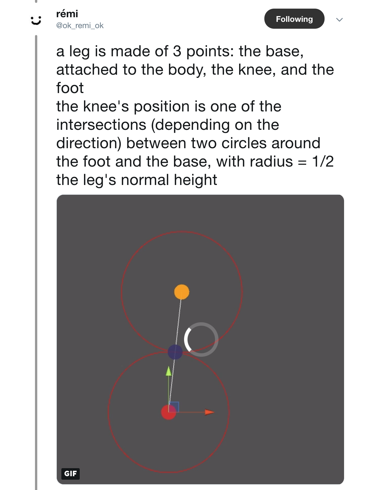
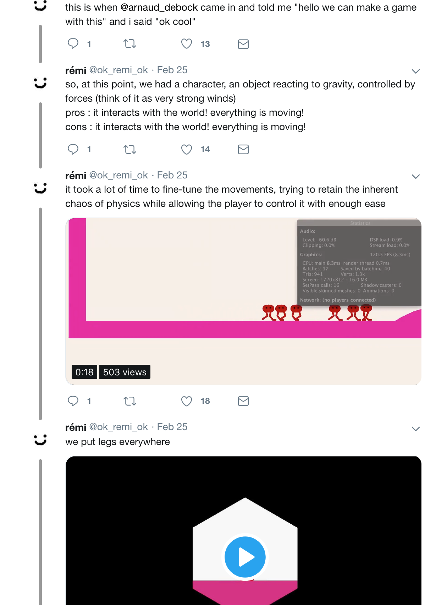
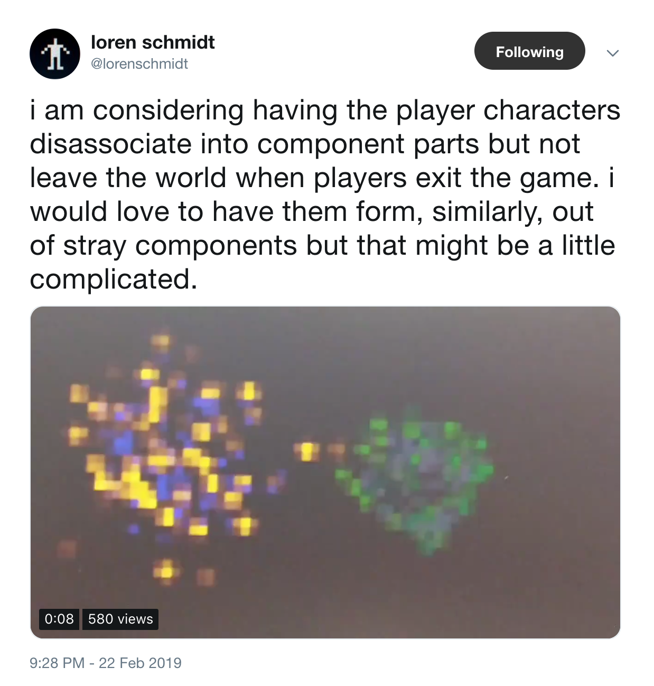
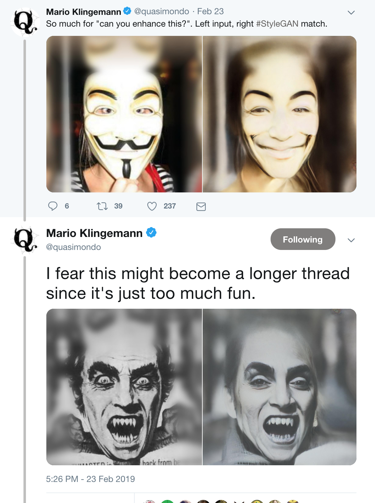
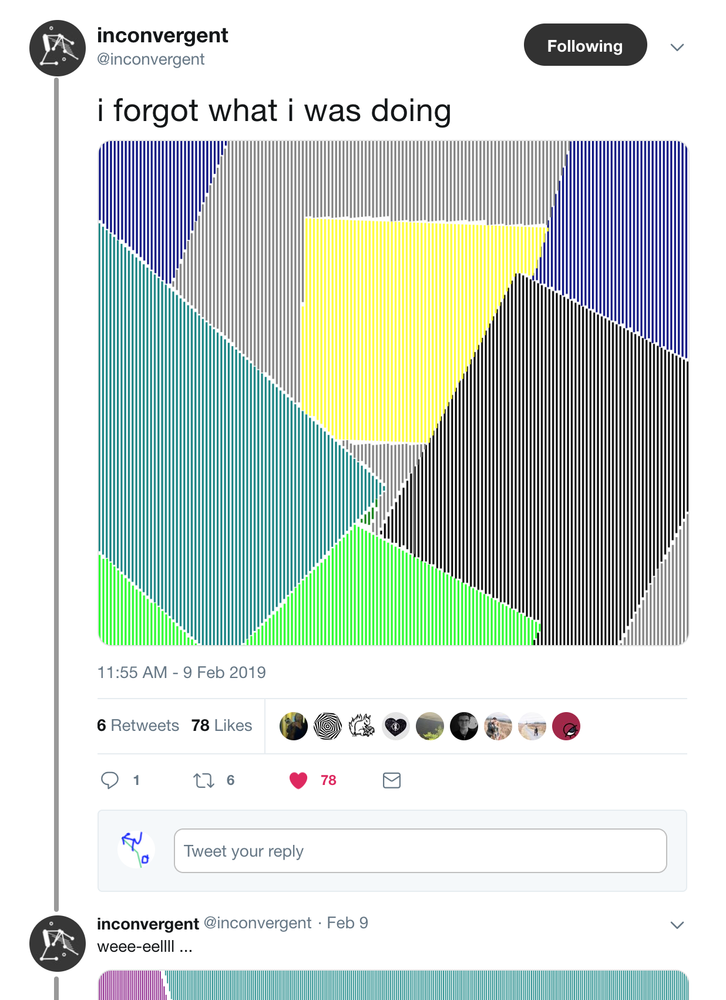
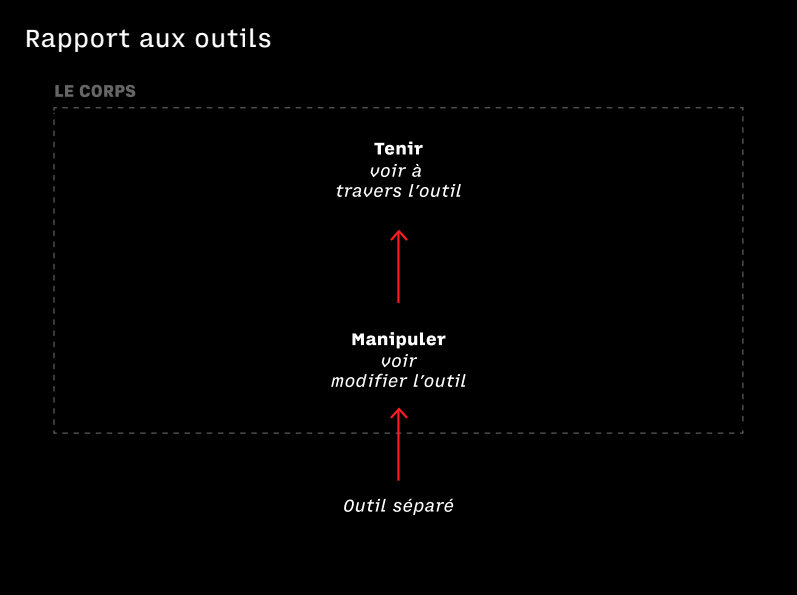
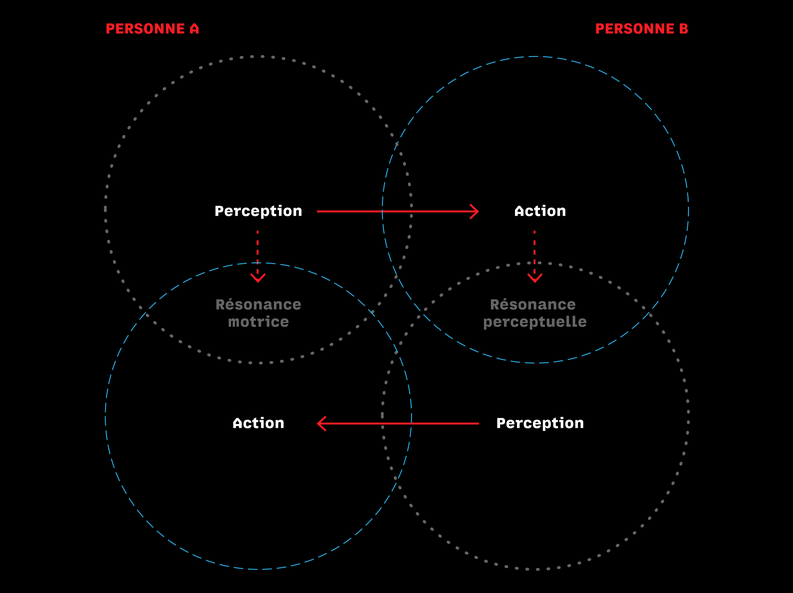
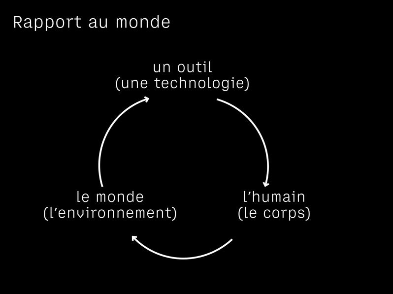

# UE Outils de représentation et d'interaction : Initiation à Processing et à Arduino

## Studio Chevalvert

[Chevalvert](https://chevalvert.fr/about/) est un studio de design visuel basé à Paris.
Le studio conçoit des [identités](https://chevalvert.fr/identite/), des [typographies](https://chevalvert.fr/typographie/relief/) et des [installations interactives](https://chevalvert.fr/installation/).

Nous imaginons et réalisons des installations en utilisant du hardware et du software divers (stripLEDs, capteurs, Leap Motion, contrôleurs DMX, nodeJS, JavaScript ...) :
- [Stratum](https://chevalvert.fr/installation/stratum/) 
- [Le temps Suspendu](https://chevalvert.fr/installation/le-temps-suspendu/)
- [Mechane](https://chevalvert.fr/installation/mechane/)

Nous réalisons aussi des dispositifs en utilisant le software de programmation graphique [Processing](https://processing.org/) :  
- [Ink under paper](https://chevalvert.fr/installation/ink-under-paper/)  
Dans ce projet nous questionnons le lien entre la matière physique (le papier) et la matière numérique (l'encre digitale créée avec un algorithme qui simule un comportement liquide). 
- [Mechanical Frames](https://chevalvert.fr/installation/mechanical-frames/)
Une autre possibilité est de lier la génération graphique de Processing à des données physiques qui sont transmises au programme par la carte électronique ([Arduino](https://www.arduino.cc/), reliée à son tous à des capteurs.  

## Objectifs du workshop 

6 séances de 4h
- S'initier à [Processing](https://processing.org/)
- S'initier à [Arduino](https://www.arduino.cc/)
- S'initier aux capteurs
- Faire communiquer Processing et Arduino en utilisant la librairie [SensorShield](https://github.com/MAKIO135/sensorShieldLib)
- Concevoir et prototyper un dispositif ou une expérience de captation/perception (par groupes de 3)
- Présenter le projet lors de la dernière séance

## Processus et documentation 

Tout au long du workshop vous devrez respecter une méthodologie de documentation de vos projets. Pour cela :

- Nous analyserons la méthodologie pour concevoir, réaliser et documenter des prototypes de dispositifs interactifs (étude de cas du projet ["Ink under paper"](https://bricks.chevalvert.fr/projects/ink-under-paper/user:upmc) du studio Chevalvert)

- Pour chacun des exercices pratiques vous créerez un dossier avec
	- le programme
	- le schéma du circuit (s'il y en a)
	- une photo du circuit et/ou une capture d'écran du résultat visuel du programme
	- une vidéo/des photos du dispositif en action

- Pour le projet final vous réaliserez :
	- la note d’intention
    - le descriptif du programme
    - le synoptique technique
    - le programme et le circuit nécessaire
    - la documentation photo et/ou vidéo  

### Exemples de documentation

Sur Twitter, beaucoup d'artistes, designer et développeurs créatifs documentent leurs projets de façon totalement décomplexée. 

L'important n'est pas de montrer un projet fini avec une vidéo léchée, mais de documenter le _work in progress_ avec son lot d'erreurs et de bugs.

Twitter devient un journal de bord.

## Sujet : Humanimal
### Être capteur

En collaboration avec Simon Renaud.

#### Problématique
"Agir & percevoir à la manière de..."

#### Sélection des contenus présentées par Simon Renaud

##### Notre corps, notre vision du monde.
Nous percevons le monde extérieur grâce à nos organes de sens.

En permanence, nous analysons de manière plus ou moins consciente les informations dont nous disposons grâce à nos yeux, nos oreilles, notre langue, notre nez et notre peau. Bref, nos capteurs naturels.

Il y a diverses modalités de stimulus :
- lumière
- son
- pression
- température
- goût
- odeurs

##### L'outil
«L’outil apparaît comme une véritable sécrétion du corps et du cerveau ; on peut donc appliquer à cet organe artificiel les normes des organes naturels.» Le Geste et la parole, André Leroi-Gourhan. 1964, vol. 1

*Diagramme par Simon Renaud*

##### Percevoir c'est agir
«On ne perçois jamais ce qui donne à percevoir. Ni sa rétine, ni ses mouvements oculaires, ni ses lunettes, etc.» Charles Lenay

*Diagrammes par Simon Renaud*

### Déroulé
Cours 1 (salle informatique 435) : 
- Présentation Chevalvert et projets (30min)
- Initiation à Processing : outil de dessin (2h)
- Présentation des projets inités par les groupes (1h)
- Travailler sur le projet (30min)
	- le tableau de compétence animal
	- la note d’intention
	- le descriptif du programme
	- le synoptique technique

Tableau de compétence animal

| Animal         | Particularité  | Organe/capteur   | Possibilité  |
| :-----------:  |:--------------:|:----------------:|:------------:|
| Serpent        | —			  | —                | —            |
| Araignée       | —		      | —                | —            |
| Caméléon       | —		      | —                | —            |
| Chauve-souris  | —		      | —                | —            |

Cours 2 (salle micro 101) :
- Initiation à Processing ?
- Initiation à Arduino ?
- Complétion du tableau avec les capteurs disponibles sur Adafruit/Sparkfun
- Complétion du tableau avec les capteurs disponibles au fablab
- Complétion du tableau avec des solutions low tech

Compléter le tableau de compétence animal avec deux colonnes dédiées aux capteurs :

| Animal         | Particularité  | Organe/capteur   | Possibilité  | Capteur dans le marché  | Capteur conçu de façon low-tech  |
| :-----------:  |:--------------:|:----------------:|:------------:|:-----------------------:|:--------------------------------:|

Cours 3 (salle 46-56-101 créa fablab) :
- Initiation à Arduino ?
- Communication Processing < > Arduino
- Initiation aux capteurs
- Conception des dispositifs : 
	- la note d’intention
	- le descriptif du programme
	- le synoptique technique
	- réalisation de PoCs
	- choix d'un dispositif

Cours 4 (salle 46-56-101 créa fablab) :
- Réalisation du dispositif
- Documentation

Cours 5 (salle 46-56-101 créa fablab) :
- Réalisation du dispositif
- Documentation

Cours 6 (salle 46-56-101 créa fablab) :
- Réalisation du dispositif
- Documentation
- Présentation

## Qu'est-ce que Processing ?

[→ Initiation à Processing](/1-Processing)

## Qu'est-ce qu'Arduino ?

[→ Initiation à Arduino](/2-Arduino)

## License

[MIT.](https://tldrlegal.com/license/mit-license)
